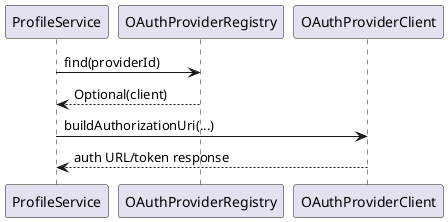
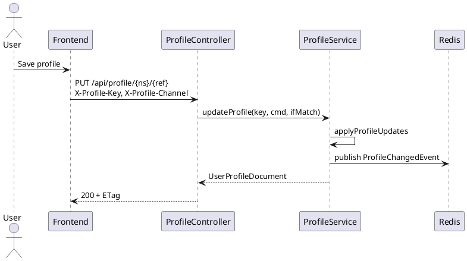
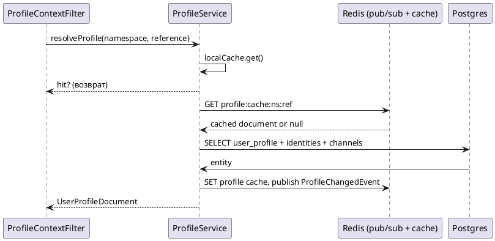

# Personalization Architecture

Персонализация обеспечивает единый профиль пользователя (namespace/reference ↔ profile_id) и общий доступ к настройкам, ролям и внешним идентификаторам для web, Telegram, CLI и будущих клиентов. Этот документ описывает основную модель данных, поток OAuth (Wave 42 подготовка к Wave 43) и dev-only сценарии.

## 1. Модель данных
- `user_profile`: канонический профиль (namespace, reference, displayName, locale, timezone, communicationMode, habits[], antiPatterns[], workHours, metadata, version).
- `profile_lookup`: idempotent соответствие namespace/reference → profile_id.
- `user_profile_channel`: channel overrides (web/telegram/etc) с JSON-настройками.
- `user_identity`: внешние провайдеры (provider, external_id, attributes, scopes). Токены/секреты выносятся в отдельную таблицу (`user_identity_secret`) в Wave 43.
- `oauth_token`: подготовленная таблица для хранения зашифрованных access/refresh токенов. Связана 1:1 с `user_identity`, содержит `token_type`, `scopes[]`, `expires_at` и служит источником для refresh job.
- `profile_role`, `role`, `permission`, `role_permission`: RBAC.
- `profile_audit_event`: журнал `profile_created/profile_updated/identity_attached/...`.

## 2. Поток OAuth (Web)
**Цель:** подготовить инфраструктуру к VK OAuth (Wave 43), описать хранение `state`/`codeVerifier` и требования к шифрованию токенов.

### Компоненты
- `OAuthProviderProperties` (`app.oauth.providers.<id>`): описание провайдера (authorizationUri, tokenUri, userInfoUri, redirectUri, scopes, clientId, clientSecret).
- `OAuthProviderClient`: SPI-интерфейс с методами `buildAuthorizationUri`, `exchangeCode`, `refreshToken`, `fetchUserInfo`.
- `OAuthProviderRegistry`: централизованный реестр клиентов; адаптеры регистрируются в Spring через `registry.register(client)`.



```
+---------+      browser      +-----------+      backend      +-----------+
|  User   | 1. click "Link" → |  Frontend | → 2. GET /auth/vk |  Backend  |
+---------+                   +-----------+                  +-----------+
                                                           | Profile svc|
                                                           +-----------+
```

1. Пользователь инициирует `POST /api/profile/{ns}/{ref}/identities` или нажимает кнопку в UI.
2. Backend генерирует `state` и `codeVerifier` (PKCE S256), сохраняет их в Redis (ключ `oauth:vk:{profileId}:{state}`) с TTL (например, 5 мин) и возвращает redirect URL `https://id.vk.ru/authorize?...&state=&code_challenge=`.
3. После редиректа обратно (`/auth/vk/callback`) backend валидирует `state`, отправляет `code_verifier` на `https://id.vk.ru/oauth2/token`, получает токены, шифрует `access_token`/`refresh_token` (pgcrypto/AES-GCM, master key — Vault/KMS) и сохраняет в `user_identity_secret`.
4. Обновлённый профиль публикуется в кеш (`ProfileChangedEvent`), а audit фиксирует `identity_attached`.

### Требования
- Все секреты в `user_identity_secret` шифруются на уровне БД (`pgcrypto`), а доступ выдаётся только сервисному пользователю backend.
- Refresh loop: `OAuthTokenRefreshScheduler` (Spring `@Scheduled(fixedDelay = 1m)`) выбирает записи `user_identity` с `expires_at < now() + 15m`, читает зашифрованный `refresh_token` и вызывает `OAuthProviderClient.refreshToken`. Успешные обновления должны:
  - обновлять `expires_at`/`access_token`/`refresh_token` атомарно;
  - публиковать audit (`token_refreshed`), чтобы поддержка видела события;
  - накапливать метрики `oauth_refresh_success_total{provider}` и latency histograms.
- Ошибки refresh → `oauth_refresh_error_total{provider,reason}`, лог уровня WARN, повторная попытка через backoff (3 попытки: 1мин/5мин/30мин). При полном истечении токена нужен manual action (UI показывает «перепривяжите аккаунт»).
- Реестр обязан логировать отсутствие клиента (`providerId` не найден) и возвращать 404/422 в REST, чтобы UI корректно отображал недоступные провайдеры.
- Хранить `state`/`codeVerifier` только в Redis; при истечении TTL — требовать повтор авторизации.

## 3. Telegram Login Widget
- Bot должен быть привязан к домену `ai.riabov.tech` (`BotFather /setdomain`).
- Frontend добавляет `<script async src="https://telegram.org/js/telegram-widget.js?22" data-telegram-login="botname" data-size="large" data-auth-url="/auth/telegram/callback" data-request-access="write"></script>`.
- Backend endpoint (`/auth/telegram/callback`) проверяет подпись: формирует `data_check_string`, считает `HMAC_SHA256(data_check_string, SHA256(bot_token))` и сравнивает с `hash`.
- При успешной проверке создаёт/обновляет `user_identity` (`provider=telegram`), публикует событие и возвращает одноразовый dev-link статус (см. ниже).
- Replay protection: хранить `hash` в Redis (`used_hash:<hash> TTL=60s`).

### Общий sequence
```
User → Web UI (widget) → Backend callback → ProfileService.resolveOrCreate()
     → attachIdentity(provider=telegram, externalId)
     → ProfileAuditEvent(identity_attached)
     → Redis publish ProfileChangedEvent → LLM/Telegram клиенты сбрасывают кеш
```

## 4. Dev-only сценарии
- В `application.yaml`: `app.profile.dev.enabled=true`, `app.profile.dev.token=dev-profile-token`, `app.profile.dev.link-ttl=10m`.
- Центральный guard (`ProfileContextFilter` + `ProfileSecurityService`) принимает заголовок `X-Profile-Auth`, валидирует `X-Profile-Key` и помечает запрос как dev-only.
- `POST /api/profile/{ns}/{ref}/dev-link` (только в dev-режиме) генерирует код (`ABCDEFGHJKMNPQRSTUVWXYZ23456789`, 8 символов), хранит его в Caffeine-cache с TTL из `linkTtl` и возвращает `{code, channel, expiresAt}`.
- Фронтенд баннер “Dev session” отображает token, предупреждение и результат генерации. Telegram/CLI позже смогут вводить код для привязки профиля.

## 5. Мониторинг и cron-джобы
- `profile_resolve_seconds`, `user_profile_cache_hit/_miss`, `profile_identity_total` — базовые метрики.
- Для OAuth-refresh: `oauth_refresh_success_total`, `oauth_refresh_error_total`, `oauth_refresh_latency_seconds` (с тегами `provider`).
- Алерты: рост ошибок (>5% refresh failure), устаревшие токены (`expires_at < now + 15m`).

## 6. Sequence диаграммы (PlantUML)


```plantuml
@startuml
actor User
participant "Frontend" as FE
participant "ProfileController" as API
participant "DevProfileLinkService" as DEV
participant "Telegram" as TG
User -> FE: нажимает "Создать dev-link"
FE -> API: POST /api/profile/ns/ref/dev-link
API -> DEV: issueLink(profileId)
DEV --> API: code + expiresAt
API --> FE: {code, expiresAt}
FE -> User: показать код
(User uses code в Telegram) # future Wave 43
@enduml
```

## 7. Lookup → кеш → БД
Чтобы визуализировать стандартный запрос (LLM чат или Flow), используем следующую диаграмму:



### Обмен между каналами
Последовательность «web изменил профиль → Telegram получил обновления»:

```plantuml
@startuml
actor WebUser
participant "Web UI" as web
participant "ProfileController" as api
participant "ProfileService" as svc
participant "Redis pub/sub" as red
participant "TelegramBot" as tg

WebUser -> web: PUT /api/profile/web/demo
web -> api: JSON + If-Match
api -> svc: updateProfile
svc -> db: UPDATE user_profile
svc -> red: publish ProfileChangedEvent(ns=web,ref=demo)
svc --> api: updated profile
api --> web: 200 + ETag

tg -> red: subscribe profile:changed
red --> tg: ProfileChangedEvent(profileId,...)
tg -> svc: resolveProfile(telegram,userId)
svc: cache hit or reload
tg: обновляет системное сообщение / UI команд
@enduml
```

### Pub/Sub инвалидация кеша
- `UserProfileService` после любого изменения профиля публикует `ProfileChangedEvent(profileId, namespace, reference, updatedAt)` через `ProfileChangePublisher`.
- При наличии Redis в окружении используется `RedisProfileChangePublisher`, который пишет событие в канал `profile:cache:events`. В dev-режиме без Redis события отправляются прямо в `ApplicationEventPublisher`.
- `ProfileCacheInvalidator` подписан на эти события (через Spring events или Redis listener) и вызывает `UserProfileService.evict(...)`, чтобы удалить запись из локального Caffeine и Redis. Это позволяет синхронно сбрасывать кэш на всех нодах.
- Метрики: `user_profile_cache_evict_total` (ручные и автоматические сбросы), `user_profile_cache_invalidation_total` (успешные обработки событий), `profile_resolve_seconds`, `user_profile_cache_hit/_miss`.
- E2E покрытие: `UserProfileCacheRedisIntegrationTest` поднимает Postgres + Redis Testcontainers, проворачивает `resolveProfile → pub/sub → evict` и проверяет, что `findProfile` возвращает `Optional.empty()` после обработки события.

## 7. Контракты API
- `GET /api/profile/{namespace}/{reference}`
- `PUT /api/profile/{namespace}/{reference}` (If-Match обязательный)
- `POST /api/profile/{namespace}/{reference}/identities`
- `DELETE /api/profile/{namespace}/{reference}/identities/{provider}/{externalId}`
- `GET /api/profile/{namespace}/{reference}/audit`
- `POST /api/profile/{namespace}/{reference}/dev-link` (dev-only)
- `GET /api/admin/roles/profiles` + `POST/DELETE /api/admin/roles` (раздел “Admin / Roles”)

## 8. Будущие задачи (Wave 43)
- Реализовать фактический VK OAuth контроллер (`/auth/vk`, `/auth/vk/callback`).
- Хранение токенов в `user_identity_secret` с ротацией ключей.
- Telegram Login Widget end-to-end сценарий (виджет на фронте + backend подпись).
- CLI/Telegram команды `/link_vk`, `/link_profile`, которые используют dev-link API на тестовых окружениях.

## 9. UX-спеки привязки внешнего провайдера
Чтобы фронтенд и Telegram/CLI клиенты работали консистентно, закрепляем единый UX-флоу «привязать внешний аккаунт» (VK/GitHub/Google).

1. **Точка входа.** На странице профиля отображаем карточку «Внешние провайдеры» с кнопками `Link VK`, `Link GitHub`, `Link Google`. В Telegram командой `/link_vk` и inline-кнопкой. Кнопка доступна только при dev-token или валидной сессии.
2. **Запрос авторизации.** Клиент вызывает `POST /api/profile/{ns}/{ref}/identities/{provider}/authorize` (Wave 43), получая json: `{authorizationUrl, state, deviceId, expiresAt}`.
3. **UI реагирует.**
   - Web: открываем модалку с инструкцией и кнопкой «Перейти в VK», плюс отображаем state/deviceId для Telegram fallback.
   - Telegram: бот отправляет deep-link `https://id.vk.ru/...&state=...` и помечает чат статусом `linking`.
4. **Poll статуса.** После редиректа backend сохраняет identity. UI поллит `GET /api/profile/{ns}/{ref}/identities/status?provider=vk&state=...` раз в 2–3 сек (таймаут 2 мин). Telegram получает webhook `identity_linked`.
5. **Завершение.** При успехе UI обновляет профиль (через `GET /api/profile/...`) и показывает баннер «VK подключён». При ошибке — статус + кнопка «повторить».

Требования:
- Иметь единый компонент уведомлений (toast) для статусов linking.
- Все состояния (loading, waiting callback, success, error) логируем в `profile_audit_event` (`event_type = identity_link_pending|identity_attached|identity_failed`).
- Для CLI/TG сценариев сохраняем `deviceId` и отображаем QR/код в вебе, чтобы пользователь мог открыть ссылку на другом устройстве.
